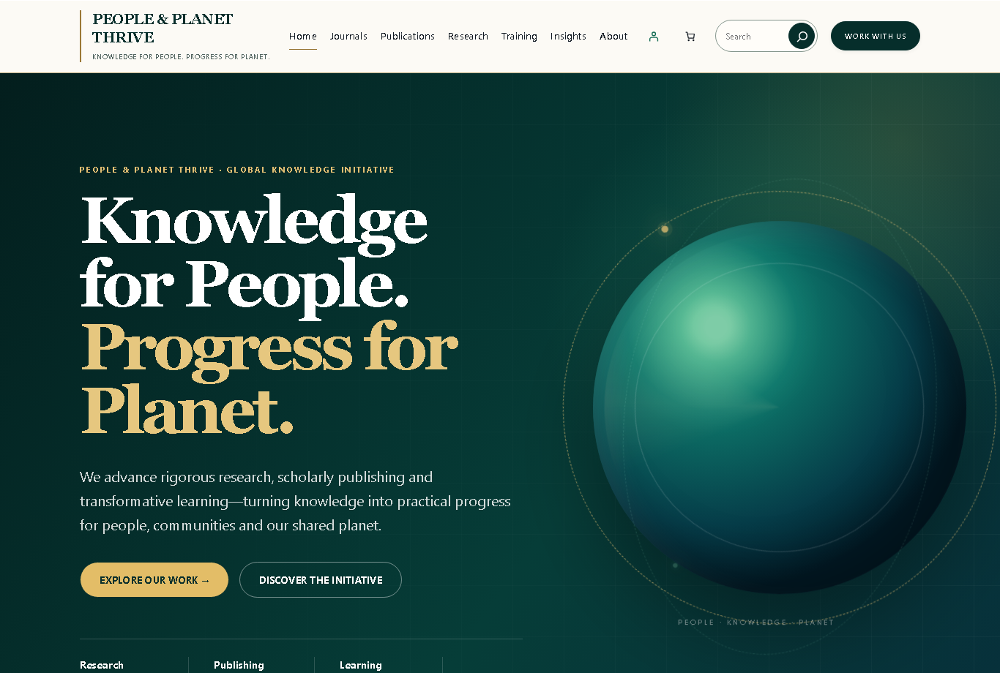

# Screenshot correction — version 2.3.2

The reported screenshot exposed defects that the 2.3.0 QA matrix did not catch. Insights was not included in the earlier responsive scan, and checks for HTTP success, overflow and H1 count did not validate the actual heading size or header line wrapping. Earlier test results do not establish acceptable visual quality on this installation.

## Changes

- Restored the missing numeric font/spacing tokens and semantic colour aliases used by the supplied PHP templates. The original archive template now receives its intended heading scale, ivory section background and card padding.
- Constrained header spacing, site-title line height and search width. The uppercase site name is tested at 1366px; desktop navigation stays on one line and switches to the accessible overlay before available space is exhausted.
- Preserved the approved homepage composition, palette, orb, intro and footer.
- Underlined Insights author bylines after the fresh accessibility scan found they depended on colour alone.
- Recognized both plain-text and block versions of the exact untouched English Hello world starter. Setup drafts that starter and preserves original text even when the title matches.
- Added admin setup notices for an inactive PPT Core plugin, missing setup, and latest-posts homepage configuration. Setup and demo import remain explicit administrator actions; installing a theme alone does not populate WordPress content.
- Corrected category assignment for untouched demo Insights so they do not also retain Uncategorized. Edited content is protected by the importer fingerprint.
- Bumped theme/plugin versions to 2.3.2 for asset cache invalidation.

## Applying the correction

1. Back up the current installation. Upload the replacement PPT Core and theme ZIPs over the existing versions.
2. Activate both, then run Tools → PPT Site Setup. This repairs missing setup records and safely drafts a recognized untouched starter post.
3. If the root URL shows Insights, check Settings → Reading: use a static Home page and set Insights as the posts page. An existing deliberate homepage choice is preserved.
4. If demonstration content is wanted, use Tools → PPT Demo Content → Import. It is not imported automatically.
5. Purge SpeedyCache (visible in the supplied screenshot), any hosting/CDN cache, and reload. Confirm the installed version is 2.3.2.

The original screenshot did not include its URL, so its root-page versus Insights-page context remains unverified. A later read-only inspection of https://ppthrive.com/ confirmed that its public root currently serves the approved hero. This does not resolve the screenshot's archive/header defects. No production changes were made.

## Final visual review

The 2.3.2 header retains the editable native menu, with an ivory background, restrained gold rule/active indicator, integrated search and sticky scroll treatment. The mobile overlay confinement caused by backdrop-filter was removed. Desktop at 1366px and mobile at 375px images were inspected; geometry, keyboard, no-JavaScript and reduced-motion checks are recorded in QA-REPORT.md.

